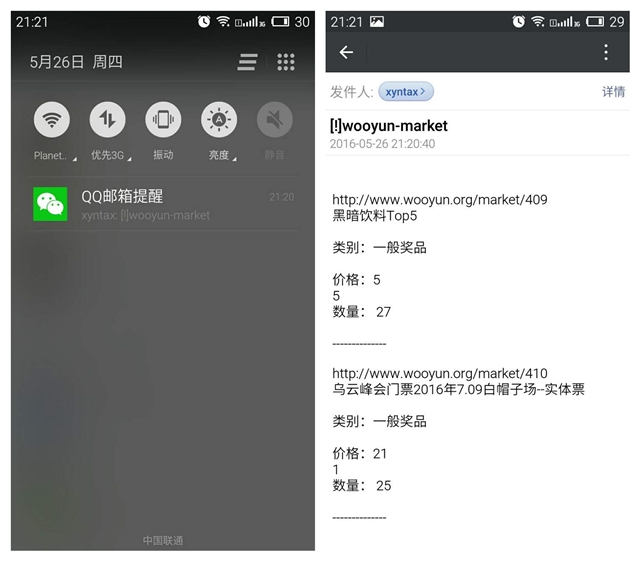

# wooyunMonitor
wooyun.org 页面监控( 集市商品刷新通知 )

**监控乌云集市新商品上架信息，自动发送到用户邮箱。**

## 效果图

## 使用说明

### 1 配置
脚本运行之前，需要用户手动修改以下两个文件:
  
* mail/sendmail.py
```
# 用户需要配置以下四处注释所在代码
def send_mail(title='default_title', content='default_content',
              to_list=list()):
    mail_host = "smtp.163.com"          # smtp服务器
    mail_user = "xyntax@163.com"        # 邮箱
    mail_pass = "******"                # 第三方授权密码 (和登录密码不同)
    me = "xyntax@163.com"               # 邮箱
```

* market.py
```
mail_list = [
    'xxxxxxx@qq.com',  # 替换成接收提醒的邮箱 (建议qq邮箱，这样就能在微信里直接看到通知)
]
```

### 2 运行(计划任务)
使用计划任务配置脚本
  
* Linux可以编辑/etc/crontab,如下配置即**每分钟**运行一次脚本

```
* * * * *  root  python /root/wooyunMonitor/market.py
```

* 然后等着收邮件就好了

## 注
第一次运行时，程序会自动发送邮件作为测试，邮件内容是【从2016.05.26到您此刻程序运行为止】这一期间的乌云集市更新